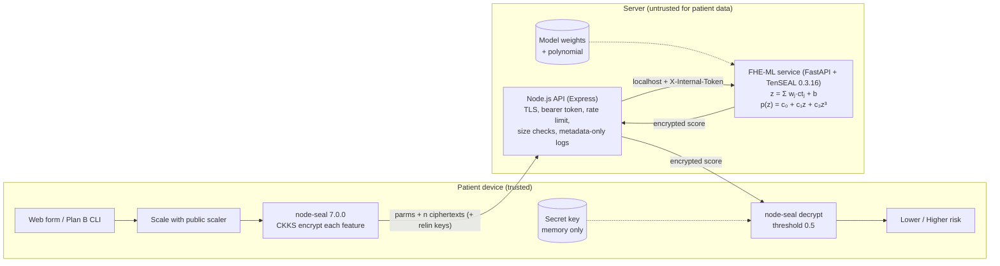
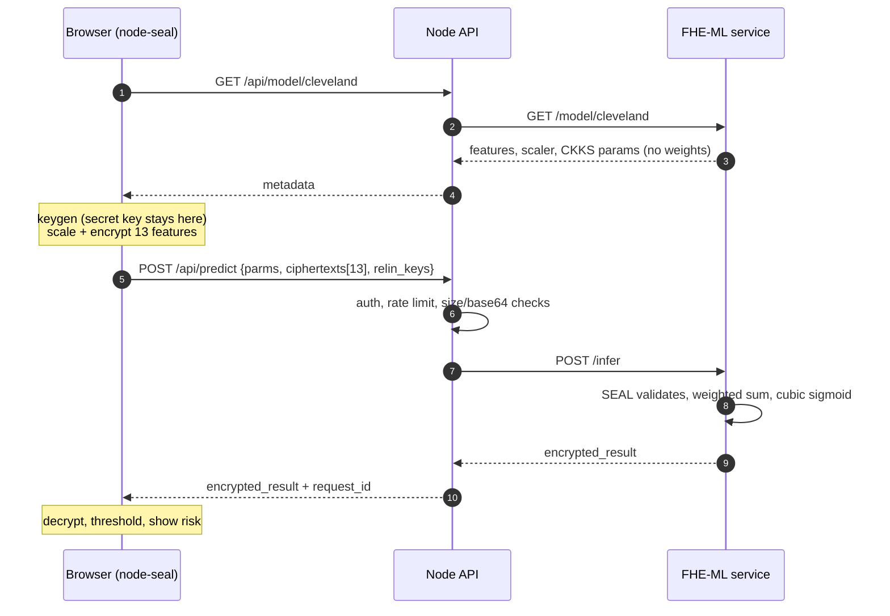
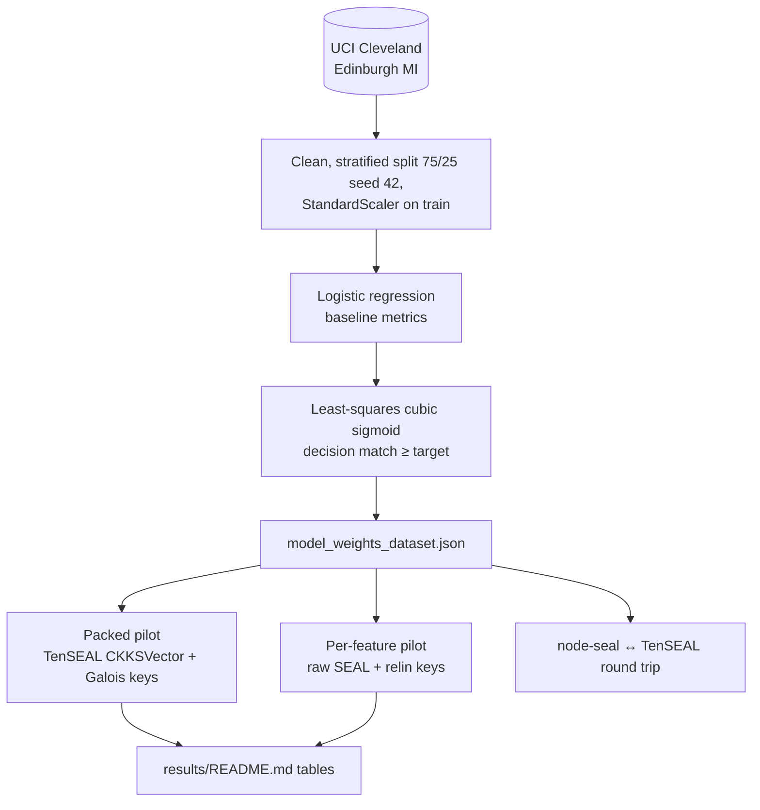

# Diagrams (Mermaid – GitHub renders these)

## System architecture

```mermaid
flowchart LR
  subgraph Client["Patient device (trusted)"]
    F[Web form / Plan B CLI] --> S[Scale with public scaler]
    S --> E["node-seal 7.0.0<br/>CKKS encrypt each feature"]
    K[(Secret key<br/>memory only)] -.-> D
    D["node-seal decrypt<br/>threshold 0.5"] --> R[Lower / Higher risk]
  end
  subgraph Server["Server (untrusted for patient data)"]
    A["Node.js API (Express)<br/>TLS, bearer token, rate limit,<br/>size checks, metadata-only logs"]
    M["FHE-ML service (FastAPI + TenSEAL 0.3.16)<br/>z = Σ wⱼ·ctⱼ + b<br/>p(z) = c₀ + c₁z + c₃z³"]
    W[(Model weights<br/>+ polynomial)] -.-> M
  end
  E -- "parms + n ciphertexts (+ relin keys)" --> A
  A -- "localhost + X-Internal-Token" --> M
  M -- "encrypted score" --> A
  A -- "encrypted score" --> D
```

## Request sequence

```mermaid
sequenceDiagram
  autonumber
  participant B as Browser (node-seal)
  participant A as Node API
  participant F as FHE-ML service
  B->>A: GET /api/model/cleveland
  A->>F: GET /model/cleveland
  F-->>A: features, scaler, CKKS params (no weights)
  A-->>B: metadata
  Note over B: keygen (secret key stays here)<br/>scale + encrypt 13 features
  B->>A: POST /api/predict {parms, ciphertexts[13], relin_keys}
  A->>A: auth, rate limit, size/base64 checks
  A->>F: POST /infer
  F->>F: SEAL validates, weighted sum, cubic sigmoid
  F-->>A: encrypted_result
  A-->>B: encrypted_result + request_id
  Note over B: decrypt, threshold, show risk
```

## Practicum pilot workflow

```mermaid
flowchart TD
  D[(UCI Cleveland<br/>Edinburgh MI)] --> P[Clean, stratified split 75/25 seed 42,<br/>StandardScaler on train]
  P --> L[Logistic regression<br/>baseline metrics]
  L --> S[Least-squares cubic sigmoid<br/>decision match ≥ target]
  S --> Wt[model_weights_dataset.json]
  Wt --> PK[Packed pilot<br/>TenSEAL CKKSVector + Galois keys]
  Wt --> PF[Per-feature pilot<br/>raw SEAL + relin keys]
  Wt --> RT[node-seal ↔ TenSEAL round trip]
  PK --> T[results/README.md tables]
  PF --> T
```
