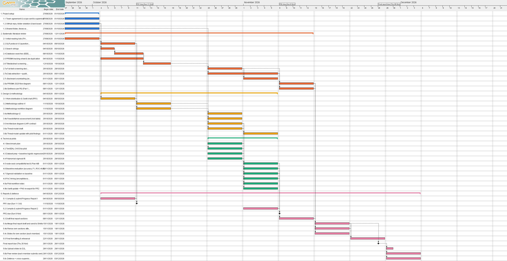

# Gantt / Timeline
Owner: Abdullah Dar (Wk 7)

*Gantt chart, Weeks 6–15 (updated 9 Oct: Week 9 break kept free, SLR stages per Protocol v3). Dotted arrows are flexible (Rubber) dependencies. **Owners are in the task table below** (the PNG shows bars only). Working week is Sunday–Thursday. Source file: [gantt/COMP4101_Practicum_Gantt.gan](gantt/COMP4101_Practicum_Gantt.gan) – open it in [GanttProject](https://www.ganttproject.biz/), edit, then re-export the PNG over the old one.*

## Milestones by week

| Week | Dates | Main milestone |
|---|---|---|
| 6 | 27 Sep–1 Oct | Setup, first readings |
| 7 | 4–8 Oct | SLR protocol, searches, **Progress Report 1** |
| 8 | 11–15 Oct | Screening, methodology outline |
| 9 | 18–22 Oct | Semester break |
| 10 | 25–29 Oct | Pilots (TenSEAL toy pilot, baseline, sigmoid), architecture + API, SLR full-text decisions + extraction starts |
| 11 | 1–5 Nov | node-seal compatibility test, evaluation, SLR extraction + snowballing, **Progress Report 2** |
| 12 | 8–12 Nov | Final report drafting, SLR synthesis per RQ + PRISMA diagram |
| 13 | 15–19 Nov | Feedback, slides |
| 14 | 22–26 Nov | **Final report (Thu 26 Nov)** |
| 15 | 29 Nov–3 Dec | **Defence** |

## Tasks (from the Gantt chart, updated 9 Oct after the plan audit)

| # | Task | Owner(s) (lead first) | Start | End |
|---|---|---|---|---|
| **1** | **Project setup** | | 27/09/2026 | 01/10/2026 |
| 1.1 | Team agreement & scope sent to supervisor | Naif | 27/09/2026 | 01/10/2026 |
| 1.2 | GitHub repo, folder skeleton & task board | Abdullah | 27/09/2026 | 01/10/2026 |
| 1.3 | Shared folder, library access, TenSEAL install test | Hassan | 27/09/2026 | 01/10/2026 |
| **2** | **Systematic literature review** | | 27/09/2026 | 12/11/2026 |
| 2.1 | Initial reading lists (FHE, heart-disease ML, sigmoid approx.) | Saif, Naif, Sarim, Khalid | 27/09/2026 | 01/10/2026 |
| 2.2 | SLR protocol v3 (questions, PICOC, criteria, team roles) | Abdullah, Naif, Saif | 04/10/2026 | 08/10/2026 |
| 2.3 | Search strings | Saif | 04/10/2026 | 05/10/2026 |
| 2.4 | Database searches (IEEE, ACM, Scopus; run + same-day confirm) | Saif + all | 06/10/2026 | 11/10/2026 |
| 2.5 | PRISMA tracking sheet & de-duplication | Hassan | 04/10/2026 | 11/10/2026 |
| 2.6 | Title/abstract screening (pairs, every record screened twice) | Saif + all | 12/10/2026 | 15/10/2026 |
| 2.7a | Full-text screening decisions (Screening Log, columns L-O) | Naif + all | 25/10/2026 | 29/10/2026 |
| 2.7b | Data extraction + quality scoring (CSV rows, partner checked_by) | Naif + all | 25/10/2026 | 05/11/2026 |
| 2.7c | Backward snowballing (reference lists of included papers) | Naif + all | 01/11/2026 | 05/11/2026 |
| 2.8a | PRISMA 2020 flow diagram | Hassan | 08/11/2026 | 12/11/2026 |
| 2.8b | Synthesis per RQ (Pair 1: RQ1+RQ4, Pair 2: RQ3, Pair 3: RQ2) | Naif + all | 08/11/2026 | 12/11/2026 |
| **3** | **Design & methodology** | | 04/10/2026 | 05/11/2026 |
| 3.1 | Work distribution & Gantt chart (PR1) | Abdullah | 04/10/2026 | 08/10/2026 |
| 3.2 | Methodology outline v1 | Naif, Saif, Sarim, Khalid | 11/10/2026 | 15/10/2026 |
| 3.3 | Methodology workflow diagram | Abdullah | 11/10/2026 | 15/10/2026 |
| 3.4a | Methodology v2 | Naif | 25/10/2026 | 29/10/2026 |
| 3.4b | Feasibility/risk assessment (risk table) | Naif | 25/10/2026 | 29/10/2026 |
| 3.5 | Architecture diagram & API contract | Abdullah | 25/10/2026 | 29/10/2026 |
| 3.6a | Threat model draft | Naif | 25/10/2026 | 29/10/2026 |
| 3.6b | Threat model update with pilot findings | Naif | 01/11/2026 | 05/11/2026 |
| **4** | **Technical pilots** | | 25/10/2026 | 05/11/2026 |
| 4.1 | Benchmark plan | Hassan | 25/10/2026 | 29/10/2026 |
| 4.2 | TenSEAL CKKS toy pilot | Saif | 25/10/2026 | 29/10/2026 |
| 4.3 | Dataset prep + baseline logistic regression | Sarim | 25/10/2026 | 29/10/2026 |
| 4.4 | Polynomial sigmoid fit | Khalid | 25/10/2026 | 29/10/2026 |
| 4.5 | node-seal compatibility test & Plan A/B | Saif | 01/11/2026 | 05/11/2026 |
| 4.6 | Baseline evaluation (accuracy, F1, ROC-AUC) | Sarim | 01/11/2026 | 05/11/2026 |
| 4.7 | Sigmoid validation vs baseline | Khalid | 01/11/2026 | 05/11/2026 |
| 4.8 | PoC timing (encrypt/decrypt time, ciphertext size) | Hassan | 01/11/2026 | 05/11/2026 |
| 4.9a | Pilot workflow notes | Abdullah | 01/11/2026 | 05/11/2026 |
| 4.9b | Gantt update + PNG re-export for PR2 | Abdullah | 01/11/2026 | 05/11/2026 |
| **5** | **Reports & defence** | | 04/10/2026 | 03/12/2026 |
| 5.1 | Compile & submit Progress Report 1 | Naif | 04/10/2026 | 08/10/2026 |
| ◆ | PR1 due (Sun 11 Oct) | – | 11/10/2026 | 11/10/2026 |
| 5.2 | Compile & submit Progress Report 2 | Naif | 01/11/2026 | 05/11/2026 |
| ◆ | PR2 due (Sun 8 Nov) | – | 08/11/2026 | 08/11/2026 |
| 5.3 | Draft final report sections | Naif + all | 08/11/2026 | 12/11/2026 |
| 5.4a | Merge final report draft and send to Shikfa | Naif | 15/11/2026 | 19/11/2026 |
| 5.4b | Revise own sections after supervisor feedback (each author) | Naif + all | 15/11/2026 | 19/11/2026 |
| 5.4c | Slides for own section (each member) | Naif + all | 15/11/2026 | 19/11/2026 |
| 5.5 | Final formatting & rehearsal | Naif + all | 22/11/2026 | 26/11/2026 |
| ◆ | Final report due (Thu 26 Nov) | – | 26/11/2026 | 26/11/2026 |
| 5.6a | Upload slides to D2L | Naif | 29/11/2026 | 29/11/2026 |
| 5.6b | Peer review (each member submits own) | Naif + all | 29/11/2026 | 03/12/2026 |
| 5.6c | Defence + cross-supervisor chat (date on D2L) | Naif + all | 29/11/2026 | 03/12/2026 |
